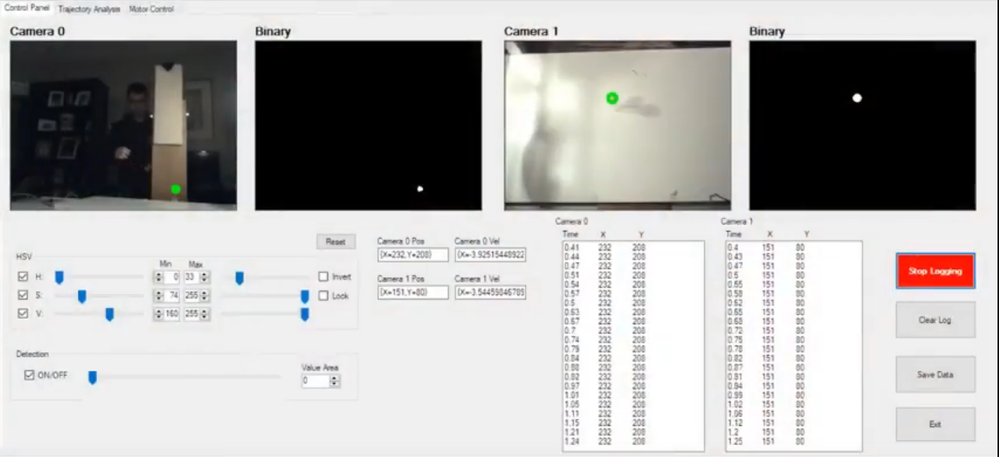

# PingPongRobotVision

This repository contains.
PS3Eye vision with trajectory planning for Ping Pong Robot Controls.

The ball detection code is based off of Emgu.CV and camera capture is to be used with PS3EYE. 
Modification have to be made to enable sending vision with other cameras.

# Set-Up
1. Install PS3EYE drivers from Code Laboratories for Windows
2. Run Mech432PingPongTracking.sln to build and run GUI.

# GUI

